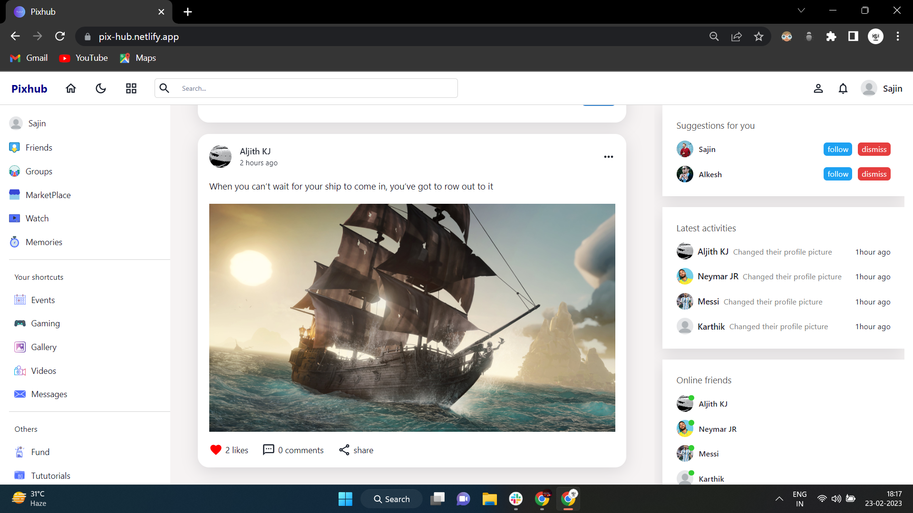

# Pixhub

 Pixhub is a social media app that allows users to create an account, update their profile, post updates, view other users' posts, follow other users, and search for users. 

 

## Pixhub has the following features:

 Account creation and login 

 Profile updates, including profile picture and cover photo, city, name and website 

 Creating a post and uploading it 

 Viewing other users' posts on the home page. 

 Engage with other users' posts by liking and commenting. 

 Following other users 

 Searching for users by name 

## Usage
### To use Pixhub, follow these steps:
 

 Sign up for an account or log in to an existing account. 

  

 Update your profile information, including your profile picture, cover photo, city, name and website. 

  

  

  

 Creating a post and uploading it. 

  

 Viewing other users' posts on the home page, Engage with other users' posts by liking and commenting 

  

 Follow other users by visiting their profile page and clicking the "Follow" button. 

  

 Search for other users by typing their name into the search bar. 

  

## Contact
If you have any questions or issues with Pixhub, please contact us at Harshsharma1421@gmail.com
